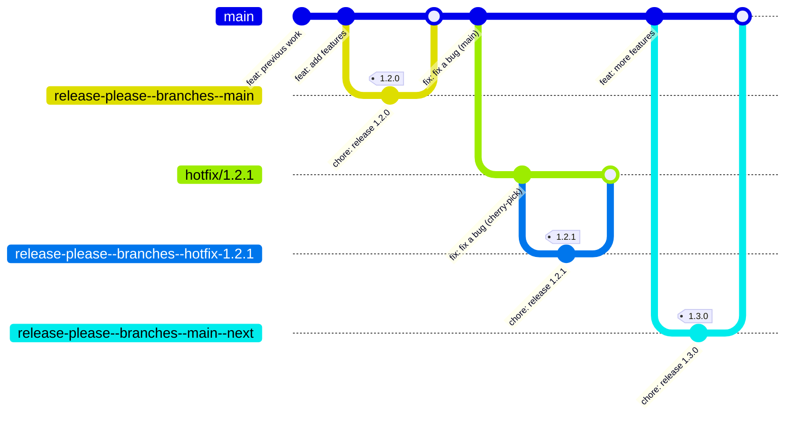

# Releasing

Releases are automated via [release-please](https://github.com/googleapis/release-please). Manual tagging, changelog editing, and version bumps are no longer required.

## How It Works

Every push to `main` triggers `.github/workflows/release.yml`, which runs release-please. It opens (or updates) a **Release PR** that:

- Bumps the version in `gradle.properties`
- Updates `CHANGELOG.md` based on conventional commits since the last release

Merging the Release PR creates a git tag and GitHub Release. That tag then triggers:

- `.github/workflows/publish.yml` -- publishes to Maven Central
- `.github/workflows/firebase-app-distribution.yml` -- distributes the catalog APK to Firebase and attaches it to the GitHub Release

Conventional commit prefixes control the version bump: `feat:` bumps minor, `fix:` bumps patch, `feat!:` / `fix!:` (breaking change) bumps major. Commits without a recognised prefix are ignored for versioning.

## Release and Hotfix Flow


## Icon Updates

Icon changes are automated via `.github/workflows/pr-icon-updates.yml`, which opens a PR titled `feat(icons): update icons`. By default this is treated as a patch bump.

## Icon Hotfix Workflow

When a PR titled `feat(icons): update icons` merges into `main`, a hotfix
release workflow is triggered automatically. As a developer, you only need to act
at two points:

1. **Update screenshots and ABI** -- If an icon is removed, added, or modified,
   paparazzi will ask you to update the golden screenshots. If an icon is added,
   removed, or renamed, update the ABI with `./gradlew updateLegacyAbi`.
2. **Merge the Release PR** that release-please opens against `hotfix/X.Y.Z+1`.
   Merging it creates the tag and publishes the new version to Maven Central.

If the cherry-pick fails (e.g. a conflict), the workflow fails visibly -- follow
the manual [Hotfix Workflow](#hotfix-workflow) instead.

## Hotfix Workflow

1. Create the hotfix branch from the release tag:
   ```bash
   git branch hotfix/X.Y.Z+1 refs/tags/X.Y.Z
   git push origin hotfix/X.Y.Z+1
   ```
2. Create a working branch, commit fixes, and open a PR targeting `hotfix/X.Y.Z+1`:
   ```bash
   git switch --create fix-hotfix-X.Y.Z+1 hotfix/X.Y.Z+1
   ```
3. Release-please opens a Release PR targeting the hotfix branch.
4. Merge the Release PR. The tag and publish workflows fire automatically.
