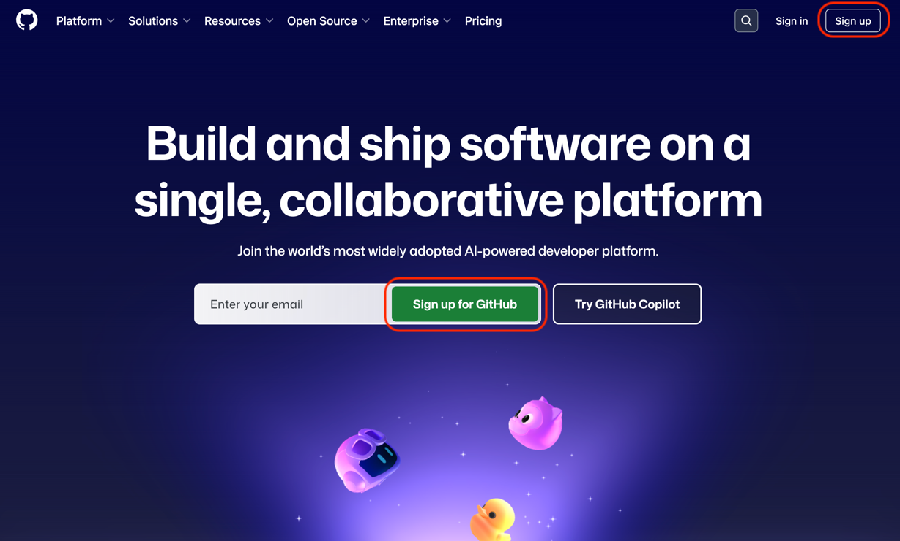
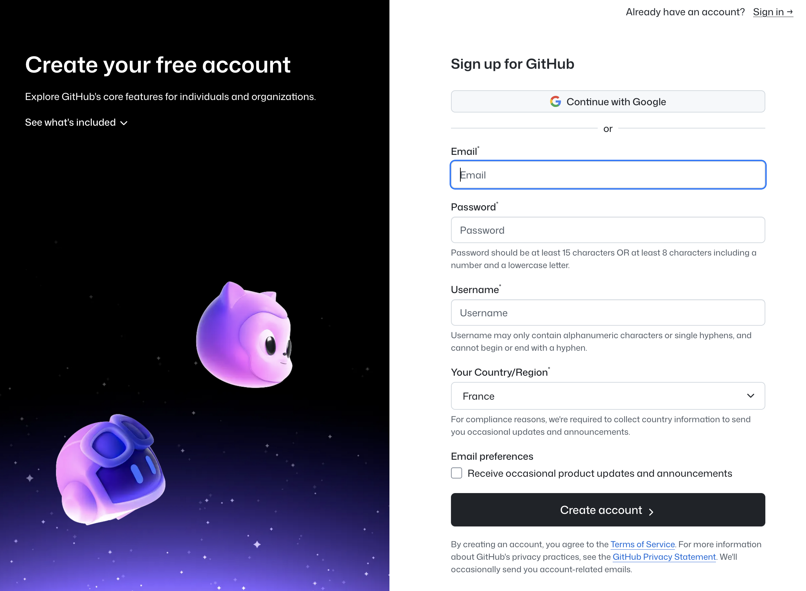
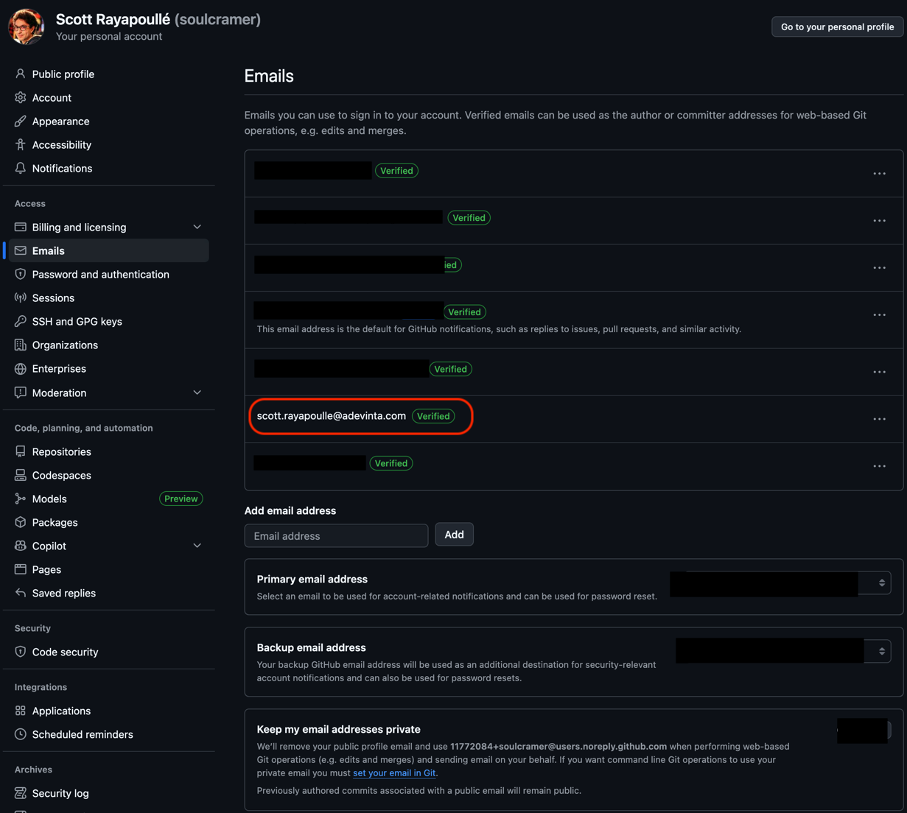

# Getting Started - Contributor Setup Guide

This guide walks you through the essential setup steps required before you can start contributing to the Spark Android Design System. Complete these steps once to prepare your development environment.

**Target audience:** New contributors to Spark Android (Leboncoin employees)  
**Estimated time:** 30-45 minutes for first-time setup

## Table of Contents

- [Prerequisites](#prerequisites)
- [🔧 GitHub Account Setup](#-github-account-setup)
- [👥 Team Access Request](#-team-access-request)
- [🔑 SSH Key Configuration](#-ssh-key-configuration)
- [📥 Repository Access](#-repository-access)
- [✅ Verification](#-verification)
- [🆘 Troubleshooting](#-troubleshooting)

---

## Prerequisites

Before starting, ensure you have:

- An Adevinta employee email address (`@adevinta.com`)
- Basic familiarity with command line/terminal
- Git installed on your computer

---

## 🔧 GitHub Account Setup

### Step 1: Create Your GitHub Account

If you don't already have a GitHub account:

1. **Navigate to GitHub**
   - Go to [github.com](https://github.com)
   - Click "Sign up" in the top right corner



1. **Account Registration**
   - Enter your **personal email** (not your Adevinta email initially)
   - Choose a professional username (e.g., `firstname-lastname` or `firstnamelastname`)
   - Create a strong password
   - Complete the verification process



1. **Email Verification**
   - Check your email for the GitHub verification message
   - Click the verification link to activate your account

### Step 2: Add Your Adevinta Email

Once your account is created and verified:

1. **Access Account Settings**
   - Click your profile picture in the top right
   - Select "Settings" from the dropdown menu

2. **Add Adevinta Email**
   - Go to "Emails" in the left sidebar
   - Click "Add email address"
   - Enter your `@adevinta.com` email address
   - Click "Add"



1. **Verify Adevinta Email**
   - Check your Adevinta email for verification
   - Click the verification link
   - **Important:** Set your Adevinta email as primary for organization access

### Step 3: Configure Your Profile

Set up a professional GitHub profile:

1. **Profile Information**
   - Uploading a profile picture would be nice to help use identify you
   - Add your job title: "Android Developer at Leboncoin"
   - Include your location if desired

2. **Privacy Settings**
   - Go to "Privacy and Security" in settings
   - Consider making your profile public to show your contributions
   - Keep your email addresses private if preferred

---

## 👥 Team Access Request

### Step 1: Locate the Android Team

1. **Navigate to Leboncoin Organization**
   - Go to [github.com/leboncoin](https://github.com/leboncoin)
   - Note: Leboncoin repositories are under the Leboncoin GitHub organization
   - Browse the organization's repositories to verify access

### Step 2: Request Team Membership

- Send a message in the Android Guild Slack channel
- Request access to the GitHub Android team
- Include your GitHub profile in the request (using your adevinta email should help the admins identify you)

### Step 3: Wait for Approval

- **Admins:** Any staff should be able to add you to the Android team. But in case none of them are available you can send a message to [#lbc-frictionlessx-public](https://adevinta.enterprise.slack.com/archives/C08B4HPSVK2)  that manages the organisation.
- **Notification:** GitHub will send you an email when we grant access
- **Next Steps:** Proceed to SSH key setup while waiting for approval

---

## 🔑 SSH Key Configuration

SSH keys provide secure authentication for Git operations without requiring passwords.

**Existing SSH Keys**: If you've already configured SSH keys for the Leboncoin Android app with Gerrit, you can reuse them for GitHub. The key requirement is that your SSH key must be associated with your Adevinta email address.

### Step 1: Check for Existing SSH Keys

Open your terminal and run:

```bash
ls -la ~/.ssh
```

Look for existing key files:

- `id_rsa` and `id_rsa.pub` (RSA keys)
- `id_ed25519` and `id_ed25519.pub` (Ed25519 keys - recommended)

### Step 2: Generate New SSH Key (if needed) & add it to the SSH agent

Use this guide from GitHub to add the SSH key to the SSH agent: [Adding a new SSH key to your GitHub account](https://docs.github.com/en/authentication/connecting-to-github-with-ssh/generating-a-new-ssh-key-and-adding-it-to-the-ssh-agent)

> [!NOTE]
> Make sure the email address is your adevinta email address like `ssh-keygen -t ed25519 -C "your.email@adevinta.com"`

### Step 3: Add SSH Key to GitHub

Follow the guide from GitHub to add the SSH key to GitHub: [Adding a new SSH key to your GitHub account](https://docs.github.com/en/authentication/connecting-to-github-with-ssh/adding-a-new-ssh-key-to-your-github-account)

### Step 4: Test SSH Connection

Test your SSH connection to GitHub:

```bash
ssh -T git@github.com
```

**Expected output:**

```text
Hi yourusername! You've successfully authenticated, but GitHub does not provide shell access.
```

---

## 📥 Repository Access

### Step 1: Clone the Spark Android Repository

After confirming your GitHub team access and SSH configuration, clone the repository to your local machine:

```bash
# Navigate to your development directory
cd ~/Development  # or your preferred location

# Clone the repository
git clone git@github.com:leboncoin/spark-android.git

# Navigate into the project
cd spark-android
```

### Step 2: Verify Repository Access

Verify your repository access and Git configuration with these commands:

```bash
# List remote repositories
git remote -v

# Output should be:
# origin  git@github.com:leboncoin/spark-android.git (fetch)
# origin  git@github.com:leboncoin/spark-android.git (push)

# Check repository status
git status

# Output should be:
# On branch main
# Your branch is up to date with 'origin/main'.
#
# nothing to commit, working tree clean

# List branches
git branch -a
# Output should be:
# * main
#  remotes/origin/main
```

### Step 3: Configure Git (if not already done)

Set up your Git identity for commits:

```bash
# Set your name (use your real name)
git config --global user.name "Your Full Name"

# Set your email (use your Adevinta email)
git config --global user.email "your.email@adevinta.com"

# Verify configuration
git config --global --list
```

---

## ✅ Verification

Run through this final verification to confirm your setup is complete and functional:

### ✅ Checklist

- [ ] **GitHub account created** with Adevinta email verified
- [ ] **Team access granted** - you can see private Leboncoin repositories
- [ ] **SSH key added** to GitHub and authentication test passes
- [ ] **Repository cloned** successfully to your local machine
- [ ] **Git configured** with your name and Adevinta email
- [ ] **Basic Git operations work** (status, branch, pull)

### Test Your Setup

Run this verification script to test your setup:

```bash
# Test 1: Verify you're in the right directory
pwd
# Should show path ending in /spark-android

# Test 2: Verify Git configuration
git config user.name && git config user.email
# Should show your name and Adevinta email

# Test 3: Test repository access
git ls-remote origin
# Should list repository branches without errors

# Test 4: Test branch operations
git checkout -b test-setup-verification
git checkout main
git branch -D test-setup-verification
# Should create, switch, and delete branch without errors
```

---

## 🆘 Troubleshooting

### Common Issues and Solutions

#### "Permission denied (publickey)" Error

**Problem:** SSH authentication is failing.

**Solutions:**

1. Verify SSH key is added to GitHub account
2. Check SSH agent is running: `ssh-add -l`
3. Test SSH connection: `ssh -T git@github.com`
4. Ensure you're using the SSH clone URL, not HTTPS

#### "Repository not found" Error

**Problem:** You don't have access to the repository.

**Solutions:**

1. Verify you're using your Adevinta email as primary on GitHub
2. Confirm team access has been granted
3. Send a message in the Android Guild Slack channel for access verification
4. Check repository URL is correct

#### SSH Key Not Recognized

**Problem:** SSH key authentication isn't working.

**Solutions:**

1. Verify public key is correctly copied to GitHub
2. Check SSH config file (macOS) includes correct settings
3. Try regenerating SSH key if it's corrupted
4. Ensure SSH agent has the key loaded: `ssh-add -l`

#### Git Clone Using HTTPS Instead of SSH

**Problem:** Repository was cloned with HTTPS, causing authentication issues.

**Solution:**

```bash
# Change remote URL to SSH
git remote set-url origin git@github.com:leboncoin/spark-android.git

# Verify the change
git remote -v
```

### Getting Help

If you encounter issues not covered here:

1. **Check Backstage documentation** for updated access procedures
2. **Ask for quick help** in the Android Guild Slack channel
3. **Report documentation issues** in #adv-spark-android channel to help us improve this guide

---

## Next Steps

Once you've completed this setup guide:

1. **Read the main [CONTRIBUTING.md](CONTRIBUTING.md)** for development workflow
2. **Set up your development environment** following the Environment Setup section
3. **Explore the codebase** and existing components
4. **Try building the project** to ensure everything works
5. **Check out the catalog app** to see components in action
